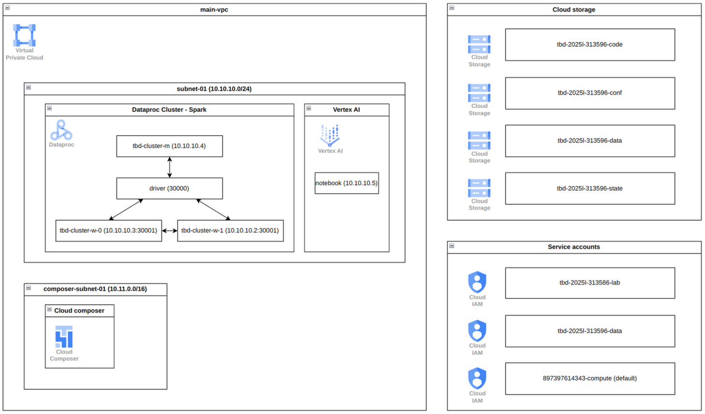

IMPORTANT ❗ ❗ ❗ Please remember to destroy all the resources after each work session. You can recreate infrastructure by creating new PR and merging it to master.
  


1. Authors:

   *Z1*

   *https://github.com/PCzerska/tbd-workshop-1.git*
   
2. Follow all steps in README.md.

3. In boostrap/variables.tf add your emails to variable "budget_channels".

4. From avaialble Github Actions select and run destroy on main branch.
   
5. Create new git branch and:
    1. Modify tasks-phase1.md file.
    
    2. Create PR from this branch to **YOUR** master and merge it to make new release. 
    


6. Analyze terraform code. Play with terraform plan, terraform graph to investigate different modules.

     Moduł data-pipelines odpowiada za przygotowanie infratruktury do przechowywania kodu i danych niezbędnych do przetwarzania w gcp. Tworzy w Google Cloud Storage 2 buckety - na dane (tbd-data-bucket) i na kod (tbd-code-bucket). Do bucketów przesyłane są pliki z kodem Spark, DAG-ami oraz projektami jako obiekty GCS. Moduł przypisuje również odpowiednie role, umożliwiające dostęp do zasobów wybranym kontom serwisowym. 
     
   
8. Reach YARN UI
   
   gcloud compute ssh tbd-cluster-m --project=tbd-2025l-313596 --zone=europe-west1-d --tunnel-through-iap -- -L 8088:localhost:8088
   


   
10. Draw an architecture diagram (e.g. in draw.io) that includes:
    1. VPC topology with service assignment to subnets
    2. Description of the components of service accounts
    3. List of buckets for disposal
    4. Description of network communication (ports, why it is necessary to specify the host for the driver) of Apache Spark running from Vertex AI Workbech
  


11. Create a new PR and add costs by entering the expected consumption into Infracost
For all the resources of type: `google_artifact_registry`, `google_storage_bucket`, `google_service_networking_connection`
create a sample usage profiles and add it to the Infracost task in CI/CD pipeline. Usage file [example](https://github.com/infracost/infracost/blob/master/infracost-usage-example.yml) 


    ```
    resource_type_default_usage:
    module.data-pipelines.google_storage_bucket.tbd-code-bucket:
    storage_gb: 192                         
    monthly_class_a_operations: 1000000       
    monthly_class_b_operations: 12500000       
    monthly_egress_data_transfer_gb:
      same_continent: 550                   
      worldwide: 12500                        
      asia: 1500                              
      china: 50                              
      australia: 250                         
    module.data-pipelines.google_storage_bucket.tbd-data-bucket:
    storage_gb: 192                         
    monthly_class_a_operations: 1000000       
    monthly_class_b_operations: 12500000       
    monthly_egress_data_transfer_gb:
      same_continent: 550                   
      worldwide: 12500                        
      asia: 1500                              
      china: 50                              
      australia: 250  
    module.vertex_ai_workbench.google_storage_bucket.notebook-conf-bucket:
    storage_gb: 192                         
    monthly_class_a_operations: 1000000       
    monthly_class_b_operations: 12500000       
    monthly_egress_data_transfer_gb:
      same_continent: 550                   
      worldwide: 12500                        
      asia: 1500                              
      china: 50                              
      australia: 250 
    google_storage_bucket.tbd-state-bucket:
    storage_gb: 192                         
    monthly_class_a_operations: 1000000       
    monthly_class_b_operations: 12500000       
    monthly_egress_data_transfer_gb:
      same_continent: 550                   
      worldwide: 12500                        
      asia: 1500                              
      china: 50                              
      australia: 250 
    module.gcp_mlflow_appengine.google_storage_bucket.mlflow_artifacts_bucket:
    storage_gb: 192                         
    monthly_class_a_operations: 1000000       
    monthly_class_b_operations: 12500000       
    monthly_egress_data_transfer_gb:
      same_continent: 550                   
      worldwide: 12500                        
      asia: 1500                              
      china: 50                              
      australia: 250 
    google_artifact_registry_repository.registry:
    storage_gb: 50                            
    module.gcp_mlflow_appengine.google_service_networking_connection.private_vpc_connection:
    monthly_egress_data_transfer_gb:
      same_region: 250                   
      us_or_canada: 100                     
      europe: 70                         
      asia: 50                           
      south_america: 100                   
      oceania: 50               


11. Create a BigQuery dataset and an external table using SQL

```sql
CREATE SCHEMA IF NOT EXISTS tbd_dataset;

CREATE OR REPLACE EXTERNAL TABLE tbd_dataset.external_sample
OPTIONS (
  format = 'ORC',
  uris = ['gs://tbd-2025l-313596-data/sample_data_100.orc']
);
```  
Pliki ORC nie wymagają osobnego schematu, ponieważ zawierają wbudowany opis struktury danych, czyli nazwy kolumn i ich typy, w samym pliku. Dzięki temu systemy, takie jak BigQuery, mogą automatycznie odczytać schemat bez potrzeby jego wcześniejszej definicji. przetłumacz na angielski.

12. Find and correct the error in spark-job.py

 Poprawa błędu:
```
  -DATA_BUCKET = "gs://tbd-2025z-9900-data/data/shakespeare/"
  +DATA_BUCKET = "gs://tbd-2025l-313596-data/data/shakespeare/"
```

Błąd polegał na wskazaniu niepoprawnej ścieżki do bucketa. Podczas uruchamiania zadania Spark na klastrze Dataproc, wystąpił błąd wskazujący na brak dostępu do pliku. Błąd został wykryty na podstawie logów w konsoli Google Cloud. 
Po ponownym uruchomieniu joba:


13. Add support for preemptible/spot instances in a Dataproc cluster

    ***place the link to the modified file and inserted terraform code***
    
    
